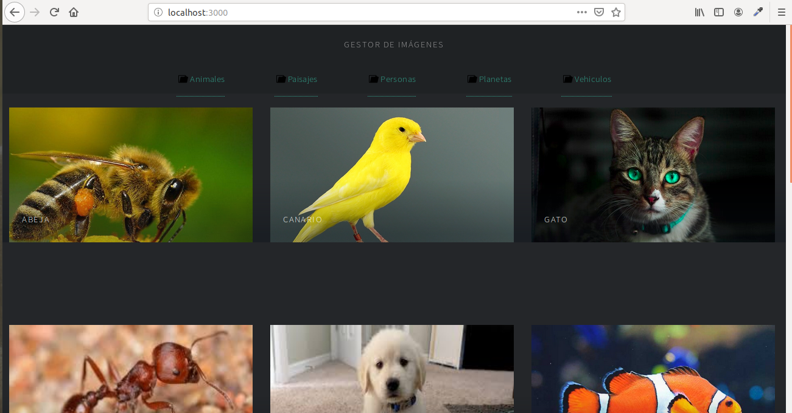
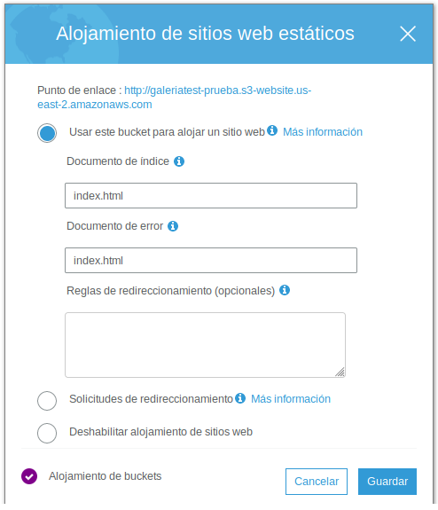
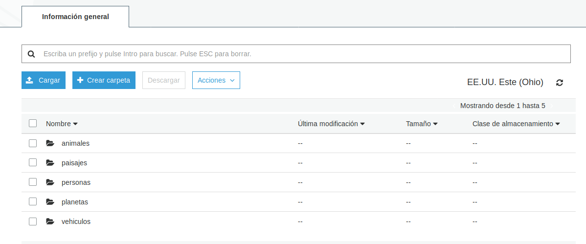

## Galería SmartSeals 

Proyecto para gestionar imágenes que se encuentran en directorios alojados en el sistema de almacenamiento **S3 de Amazon**.
Para más información de los servicios de Amazón click [aquí](https://aws.amazon.com/es/s3/faqs/?nc=sn&loc=7).

## Desarrollo

Uso de librerías:
- [x] **[React](https://www.npmjs.com/package/create-react-app)**: instalado `create-react-app`, dependencia `react-router-dom`.
- [x] **[Amplify](https://aws-amplify.github.io/docs/js/start)**: SDK de Amplify con Javascript. Manejo de **S3** con `Amplify configure`, `Amplify push`

Uso de CLI:
- [x] **[AWS CLI](https://docs.aws.amazon.com/es_es/cli/latest/userguide/cli-chap-install.html)**: Configuración llaves de acceso para **S3 Buckets** con `aws configure`.

Uso de Templates:
- [x] **[Multiverse HTML template](https://html5up.net/multiverse)**: Plantilla para mostrar las imágenes.

##  Generalidades

El proyecto se compila de manera local en `localhost:3000` ejecutando `npm run start`. 

El directorio del proyecto cuenta con componentes y carpetas que se mezclan con react y con la configuración de la otra librería usada, la ejecución de React se mantiene, pero los ficheros deben prepararse para producción y debe ejecutarse el comando `npm run build`. En la consola de administración de Amazon Web Services creamos un **Bucket**, el cual debe modificarse con una [política de seguridad](https://docs.aws.amazon.com/es_es/AmazonS3/latest/dev/example-bucket-policies.html) pública y activar el servicio de [sitios web estáticos](https://docs.aws.amazon.com/es_es/AmazonS3/latest/dev/WebsiteHosting.html).

Para envíar el proyecto a producción se debe ejecutar el comando `npm run deploy` despuesés de haber asegurado un `npm run build` e insertar en los `scripts` de `package.json` el siguiente código: `"deploy": "aws s3 sync build/ s3://[NOMBRE_DEL_BUCKET]"`.

Finalmente, se suben las carperas de la imagenes dentro del **Bucket**, las cuales serán recuperadas asíncronamente y mostradas de manera estática:

